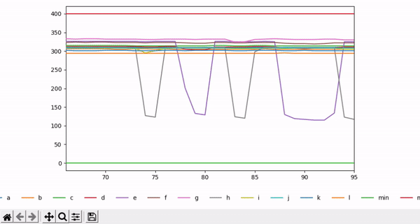

# FastPlot

<p align="center">
    
</p>

FastPlot reads a serial input stream and displays a real-time matplotlib animation. You can click the plot to pause updates, or close the window to gracefully terminate both rendering and serial communication threads. 

FastPlot assumes each line to be only consisted of numeric variables (`label`) and delimiters (`delim`). If not, you can design your own `filter` to be applied before parsing each line. Wrongly placed delimiters are automatically neglected.


## Install

```bash
pip install -r requirements.txt
```


## How to Use

### LinePlotter

```python
import fastplot as pp
import matplotlib.pyplot as plt

# append min max value of y range
f = lambda y: y+',0,400'

# specify a serial port to read
board = pp.Poller(filter=f)
board.connect('COM7', 115200)
board.start()

# draw a line plot (like a serial plot of Arduino IDE)
anim = pp.LinePlotter(
    labels=['a', 'b', 'c', 'd', 'min', 'max'], 
    poller=board, rows=30, delim=',').draw(interval=10)

# display plot animation
plt.show()
```


### BarPlotter

```python
import fastplot as pp
import matplotlib.pyplot as plt

# specify a serial port to read
board = pp.Poller()
board.connect('COM11', 115200)
board.start()

# draw a bar plot (visualize only the most recent row)
anim = pp.BarPlotter(
	labels=['r', 'x', 'y', 'z'],
    poller=board, delim='\t').draw(interval=10)

# display plot animation
plt.show()
```